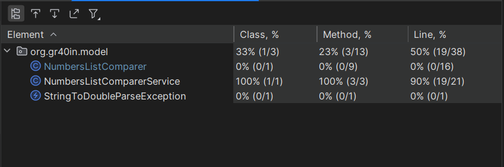

### UNIT-tests:

[NumbersListComparerServiceTest.java](src%2Ftest%2Fjava%2Forg%2Fgr40in%2Fmodel%2FNumbersListComparerServiceTest.java)
```java
package org.gr40in.model;

import org.junit.jupiter.api.Test;

import java.util.ArrayList;
import java.util.Arrays;
import java.util.List;

import static org.junit.jupiter.api.Assertions.*;

class NumbersListComparerServiceTest {
    String validData1 = "12 14 414 124 345 14";
    String validData2 = "12 14 41.4 124 345 143 1234 142345";
    String notValidData1 = "112342 14 414 1241.. 345 143 1234 14234.5";
    String notValidData2 = "12 14 414 124 3g45 143 1234 14234.5";

    @Test
    void parseStringDataToNumbersList() {
        assertEquals(NumbersListComparerService.parseStringDataToNumbersList(validData1),
                new ArrayList<>(Arrays.asList(12.0, 14.0, 414.0, 124.0, 345.0, 14.0)));
    }

    @Test
    void stringDataIsOk() {
        assertTrue(NumbersListComparerService.stringDataIsOk(validData1));
        assertTrue(NumbersListComparerService.stringDataIsOk(validData2));
        assertFalse(NumbersListComparerService.stringDataIsOk(notValidData1));
        assertFalse(NumbersListComparerService.stringDataIsOk(notValidData2));
    }

    @Test
    void getAverage() {
        List<Double> list1 = new ArrayList<>(Arrays.asList(12.2, 12.2, 12.2, 12.2, 12.2, 12.2, 12.2, 12.2, 12.2, 12.2));
        Double list1AvgCorrect = 12.2;
        Double list1AvgNotCorrect = 12.200001;
        list1AvgCorrect = list1.stream().mapToDouble(val -> val).average().getAsDouble();
        List<Double> list2 = new ArrayList<>(Arrays.asList(0.0));
        Double list2AvgCorrect = 0.0;
        Double list2AvgNotCorrect = 0.000000000000000001;
        List<Double> list3 = new ArrayList<>(Arrays.asList(-1.0, 1.0));
        Double list3AvgCorrect = 0.0;
        Double list3AvgNotCorrect = 0.0000001;
        List<Double> list4 = new ArrayList<>(Arrays.asList(1000.6, 100.2));
        Double list4AvgCorrect = 550.4;
        Double list4AvgNotCorrect = 550.0;

        assertEquals(NumbersListComparerService.getAverage(list1), list1AvgCorrect);
        assertNotEquals(NumbersListComparerService.getAverage(list1), list1AvgNotCorrect);
        assertEquals(NumbersListComparerService.getAverage(list2), list2AvgCorrect);
        assertNotEquals(NumbersListComparerService.getAverage(list2), list2AvgNotCorrect);
        assertEquals(NumbersListComparerService.getAverage(list3), list3AvgCorrect);
        assertNotEquals(NumbersListComparerService.getAverage(list3), list3AvgNotCorrect);
        assertEquals(NumbersListComparerService.getAverage(list4), list4AvgCorrect);
        assertNotEquals(NumbersListComparerService.getAverage(list4), list4AvgNotCorrect);
    }

}
```



[NumbersListComparerTest.java](src%2Ftest%2Fjava%2Forg%2Fgr40in%2Fmodel%2FNumbersListComparerTest.java)

```java
package org.gr40in.model;

import org.junit.jupiter.api.Test;

import java.util.ArrayList;
import java.util.Arrays;
import java.util.List;

import static org.junit.jupiter.api.Assertions.*;

class NumbersListComparerServiceTest {

    @Test
    void parseStringDataToNumbersList() {

    }

    @Test
    void stringDataIsOk() {
        String validData1 = "12 14 414 124 345 14";
        String validData2 = "12 14 41.4 124 345 143 1234 142345";
        String notValidData1 = "112342 14 414 1241.. 345 143 1234 14234.5";
        String notValidData2 = "12 14 414 124 3g45 143 1234 14234.5";
        assertTrue(NumbersListComparerService.stringDataIsOk(validData1));
        assertTrue(NumbersListComparerService.stringDataIsOk(validData2));
        assertFalse(NumbersListComparerService.stringDataIsOk(notValidData1));
        assertFalse(NumbersListComparerService.stringDataIsOk(notValidData2));
    }

    @Test
    void getAverage() {
        List<Double> list1 = new ArrayList<>(Arrays.asList(12.2, 12.2, 12.2, 12.2, 12.2, 12.2, 12.2, 12.2, 12.2, 12.2));
        Double list1AvgCorrect = 12.2;
        Double list1AvgNotCorrect = 12.200001;
        list1AvgCorrect = list1.stream().mapToDouble(val -> val).average().getAsDouble();
        List<Double> list2 = new ArrayList<>(Arrays.asList(0.0));
        Double list2AvgCorrect = 0.0;
        Double list2AvgNotCorrect = 0.000000000000000001;
        List<Double> list3 = new ArrayList<>(Arrays.asList(-1.0, 1.0));
        Double list3AvgCorrect = 0.0;
        Double list3AvgNotCorrect = 0.0000001;
        List<Double> list4 = new ArrayList<>(Arrays.asList(1000.6, 100.2));
        Double list4AvgCorrect = 550.4;
        Double list4AvgNotCorrect = 550.0;

        assertEquals(NumbersListComparerService.getAverage(list1), list1AvgCorrect);
        assertNotEquals(NumbersListComparerService.getAverage(list1), list1AvgNotCorrect);
        assertEquals(NumbersListComparerService.getAverage(list2), list2AvgCorrect);
        assertNotEquals(NumbersListComparerService.getAverage(list2), list2AvgNotCorrect);
        assertEquals(NumbersListComparerService.getAverage(list3), list3AvgCorrect);
        assertNotEquals(NumbersListComparerService.getAverage(list3), list3AvgNotCorrect);
        assertEquals(NumbersListComparerService.getAverage(list4), list4AvgCorrect);
        assertNotEquals(NumbersListComparerService.getAverage(list4), list4AvgNotCorrect);
    }
}
```


